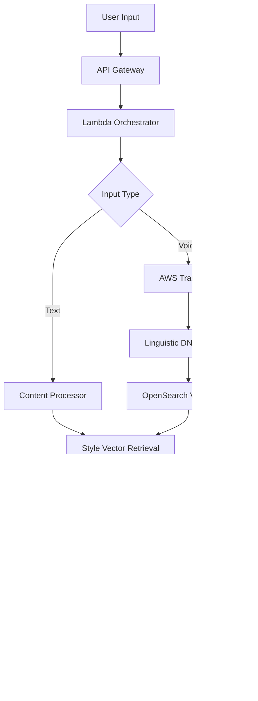

# Design Document: Swara AI Identity Layer

## Overview

Swara implements a serverless, event-driven architecture that preserves and amplifies Indian English linguistic nuances in corporate communications. The system leverages AWS's managed AI services to create a production-ready "Linguistic Sovereignty" platform that eliminates the Code-Switching Tax for Indian professionals.

The architecture follows a "Context Injection" pattern where user prompts are enriched with personalized Linguistic DNA vectors before being processed by AWS Bedrock. This approach ensures authentic voice preservation while maintaining enterprise-grade performance, security, and scalability.

## Architecture

### Serverless Event-Driven Architecture

The system is built on AWS serverless technologies to ensure automatic scaling, cost optimization, and minimal operational overhead:

- **Frontend**: Next.js 14 with Edge Runtime for global low-latency access
- **Orchestration**: AWS Lambda functions for stateless processing
- **AI Model**: AWS Bedrock with Anthropic Claude 3 Haiku for low-latency, culturally aware text generation
- **Voice Processing**: AWS Transcribe with Custom Vocabulary Filter for Hinglish pattern recognition
- **Storage**: Amazon OpenSearch for vector embeddings and user style profiles
- **Security**: AWS KMS for encryption, IAM for access control, CloudTrail for audit logging

### Data Flow Architecture



The "Context Injection" pattern works as follows:
1. User Prompt + Linguistic DNA Vector → Combined Context
2. Enhanced Context → AWS Bedrock Processing
3. Bedrock Output → Authentic, Culturally Aware Content

## Components and Interfaces

### 1. Voice Calibration Service

**Purpose**: Extracts prosodic patterns and cultural expressions from user voice samples.

**Core Components**:
- **Audio Ingestion Handler**: Processes multiple audio formats (MP3, WAV, M4A)
- **Transcribe Integration**: Leverages AWS Transcribe with custom vocabulary for Hinglish
- **Prosody Analyzer**: Extracts cadence, rhythm, and tonal patterns
- **Cultural Expression Detector**: Identifies Indian English linguistic markers

**Interface**:
```python
class VoiceCalibrationService:
    def process_audio_sample(self, audio_file: AudioFile) -> LinguisticDNA:
        """Process audio file and extract linguistic DNA"""
        pass
    
    def extract_prosody_vectors(self, transcript: TranscriptData) -> List[ProsodyVector]:
        """Extract prosody patterns from transcript"""
        pass
    
    def identify_cultural_markers(self, text: str) -> List[CulturalMarker]:
        """Identify Indian English linguistic markers"""
        pass
    
    def generate_confidence_scores(self, analysis: VoiceAnalysis) -> ConfidenceMetrics:
        """Generate confidence scores for analysis"""
        pass
```

### 2. Identity Layer Service

**Purpose**: Manages Style Vector storage, retrieval, and context injection.

**Core Components**:
- **Vector Embedding Engine**: Converts Linguistic DNA to mathematical representations
- **OpenSearch Integration**: Handles vector storage and similarity search
- **Context Injection Engine**: Combines user prompts with Style Vectors
- **Version Management**: Tracks linguistic evolution over time

**Interface**:
```python
class IdentityLayerService:
    def create_style_vector(self, linguistic_dna: LinguisticDNA) -> StyleVector:
        """Convert linguistic DNA to style vector"""
        pass
    
    def store_user_profile(self, user_id: str, style_vector: StyleVector) -> None:
        """Store user profile in OpenSearch"""
        pass
    
    def retrieve_style_vector(self, user_id: str) -> StyleVector:
        """Retrieve user's style vector"""
        pass
    
    def inject_context(self, prompt: str, style_vector: StyleVector) -> EnhancedPrompt:
        """Inject style vector into prompt context"""
        pass
```

### 3. Content Generation Service

**Purpose**: Orchestrates AI-powered content generation with cultural awareness.

**Core Components**:
- **Bedrock Integration**: Manages Claude 3 Haiku API interactions
- **Prompt Engineering**: Optimizes prompts for Indian English preservation
- **Response Processing**: Ensures output maintains authentic voice
- **Multi-format Output**: Supports text, HTML, and Markdown generation

**Interface**:
```python
class ContentGenerationService:
    def generate_content(self, enhanced_prompt: EnhancedPrompt) -> GeneratedContent:
        """Generate content using Bedrock"""
        pass
    
    def process_bedrock_response(self, response: BedrockResponse) -> AuthenticContent:
        """Process and validate Bedrock response"""
        pass
    
    def format_output(self, content: AuthenticContent, format: OutputFormat) -> FormattedContent:
        """Format content for different output types"""
        pass
    
    def validate_cultural_authenticity(self, content: str) -> AuthenticityScore:
        """Validate cultural authenticity of generated content"""
        pass
```

### 4. Analytics and Insights Service

**Purpose**: Tracks linguistic evolution and content performance metrics.

**Core Components**:
- **Usage Analytics**: Monitors feature utilization and patterns
- **Engagement Tracking**: Integrates with external platforms for performance metrics
- **Evolution Analyzer**: Tracks changes in user linguistic patterns
- **Dashboard Generator**: Creates personalized insights and recommendations

**Interface**:
```python
class AnalyticsService:
    def track_content_generation(self, user_id: str, metadata: ContentMetadata) -> None:
        """Track content generation event"""
        pass
    
    def analyze_engagement_metrics(self, user_id: str) -> EngagementReport:
        """Analyze engagement metrics"""
        pass
    
    def generate_insights_dashboard(self, user_id: str) -> UserDashboard:
        """Generate personalized insights dashboard"""
        pass
    
    def recommend_linguistic_adjustments(self, user_id: str) -> List[Recommendation]:
        """Recommend linguistic adjustments"""
        pass
```

## Data Models

### Linguistic DNA Model
```python
@dataclass
class LinguisticDNA:
    user_id: str
    prosody_vectors: List[ProsodyVector]
    cultural_markers: List[CulturalMarker]
    cadence_patterns: List[CadencePattern]
    expression_frequency: ExpressionFrequency
    confidence_scores: ConfidenceMetrics
    extraction_timestamp: datetime
    audio_sample_metadata: AudioMetadata
```

### Style Vector Model
```python
@dataclass
class StyleVector:
    vector_id: str
    user_id: str
    embeddings: List[float]
    linguistic_features: List[LinguisticFeature]
    cultural_context: CulturalContext
    version: int
    created_at: datetime
    last_updated: datetime
    performance_metrics: PerformanceMetrics
```

### Enhanced Prompt Model
```python
@dataclass
class EnhancedPrompt:
    original_prompt: str
    style_vector: StyleVector
    contextual_instructions: List[str]
    cultural_guidelines: List[str]
    authenticity_targets: List[AuthenticityTarget]
    generation_parameters: GenerationConfig
```

### Generated Content Model
```python
@dataclass
class GeneratedContent:
    content_id: str
    user_id: str
    original_prompt: str
    generated_text: str
    authenticity_score: float
    cultural_markers: List[CulturalMarker]
    engagement_prediction: EngagementMetrics
    generation_metadata: GenerationMetadata
```

## Correctness Properties

### Voice Processing Properties

**Property 1: Voice Processing Pipeline Integrity**
*For any* valid audio file in supported formats (MP3, WAV, M4A), the Voice_Calibrator should successfully extract prosody vectors, identify cultural expressions, and generate a well-formed Linguistic_DNA profile with valid confidence scores
**Validates: Requirements 1.1, 1.2, 1.3**

**Property 2: Audio Format Universal Support**
*For any* audio file in MP3, WAV, or M4A format, the Voice_Calibrator should automatically detect the format and process it successfully
**Validates: Requirements 1.5**

**Property 3: Insufficient Data Handling**
*For any* audio sample below the minimum quality threshold, the Voice_Calibrator should request additional samples with specific guidance rather than producing low-confidence results
**Validates: Requirements 1.4**

### Identity Layer Properties

**Property 4: Style Vector Lifecycle Consistency**
*For any* valid Linguistic_DNA profile, the Identity_Layer should convert it to a Style_Vector, store it in OpenSearch with proper indexing, and retrieve it correctly for context injection
**Validates: Requirements 2.1, 2.2, 2.3**

**Property 5: Style Vector Versioning**
*For any* user with multiple Linguistic_DNA updates, the Identity_Layer should maintain version history and allow retrieval of any previous Style_Vector version
**Validates: Requirements 2.5**

**Property 6: Data Encryption Consistency**
*For any* Style_Vector data access operation, encryption should be applied both at rest and in transit using AWS KMS customer-managed keys
**Validates: Requirements 2.4**

### Content Generation Properties

**Property 7: Cultural Content Generation Authenticity**
*For any* user prompt combined with a Style_Vector, the Content_Generator should produce content that preserves Indian English expressions while maintaining professional tone and includes measurable cultural markers from the original style profile
**Validates: Requirements 3.1, 3.3, 3.4**

**Property 8: Bedrock Integration Consistency**
*For any* content generation request, the system should route through AWS Bedrock with Claude 3 Haiku and return properly formatted responses
**Validates: Requirements 3.2**

**Property 9: Multi-format Content Support**
*For any* generated content, the system should be able to format it appropriately for emails, LinkedIn posts, and presentations while preserving linguistic authenticity
**Validates: Requirements 3.5**

### Performance Properties

**Property 10: Response Time Consistency**
*For any* standard content prompt, the system should respond within 3 seconds while maintaining quality standards
**Validates: Requirements 4.1**

**Property 11: Voice Processing Time Bounds**
*For any* audio sample up to 5 minutes in length, voice calibration should complete within 60 seconds
**Validates: Requirements 4.3**

**Property 12: Real-time Status Updates**
*For any* voice processing operation, the system should provide status updates at regular intervals throughout the processing lifecycle
**Validates: Requirements 4.5**

### Security and Compliance Properties

**Property 13: Stateless Processing Security**
*For any* user data processing operation, PII should only exist in memory during processing and never be persisted to storage systems
**Validates: Requirements 5.1**

**Property 14: Comprehensive Audit Logging**
*For any* data access or processing activity, the system should generate complete audit logs via AWS CloudTrail with sufficient detail for compliance requirements
**Validates: Requirements 5.4**

**Property 15: Data Deletion Completeness**
*For any* user data deletion request, all associated linguistic profiles and vectors should be permanently removed from all storage systems within 24 hours
**Validates: Requirements 5.3**

## Error Handling

### Voice Processing Errors
- **Invalid Audio Format**: Return specific format requirements and supported alternatives
- **Audio Quality Issues**: Provide detailed feedback on quality requirements and recording recommendations
- **Transcription Failures**: Implement fallback processing with reduced confidence scores
- **Cultural Pattern Detection Failures**: Gracefully degrade to general linguistic patterns

### Identity Layer Errors
- **Vector Storage Failures**: Implement retry logic with exponential backoff
- **Retrieval Timeouts**: Provide cached fallback vectors when available
- **Version Conflicts**: Implement conflict resolution with user notification
- **Encryption Key Issues**: Fail securely with detailed error reporting

### Content Generation Errors
- **Bedrock Service Unavailability**: Implement circuit breaker pattern with fallback models
- **Context Window Overflow**: Intelligently truncate while preserving key linguistic markers
- **Cultural Authenticity Validation Failures**: Provide warnings with suggested improvements
- **Format Conversion Errors**: Maintain content integrity with format-specific error handling

### System-wide Error Handling
- **Rate Limiting**: Implement graceful degradation with user notification
- **Authentication Failures**: Provide clear guidance for credential resolution
- **Data Consistency Issues**: Implement eventual consistency with conflict resolution
- **External Service Dependencies**: Implement comprehensive fallback strategies

## Testing Strategy

### Dual Testing Approach

The testing strategy employs both unit testing and property-based testing to ensure comprehensive coverage:

**Unit Tests**: Focus on specific examples, edge cases, and error conditions
- Integration points between AWS services
- Specific cultural expression detection scenarios  
- Error handling for malformed inputs
- Authentication and authorization edge cases

**Property Tests**: Verify universal properties across all inputs
- Voice processing pipeline integrity across all audio formats
- Style vector consistency for all user profiles
- Content generation authenticity for all prompt types
- Security measures applied to all data operations

### Property-Based Testing Configuration

**Testing Framework**: We will use **Hypothesis** for Python-based property testing, configured with:
- Minimum 100 iterations per property test to ensure comprehensive input coverage
- Custom generators for audio files, linguistic patterns, and user prompts
- Shrinking strategies to identify minimal failing examples
- Deterministic seeding for reproducible test runs

**Test Tagging**: Each property test must include a comment referencing its design document property:
```python
# Feature: swara-ai-identity-layer, Property 1: Voice Processing Pipeline Integrity
def test_voice_processing_pipeline_integrity(audio_file):
    # Test implementation
```

**Coverage Requirements**:
- Each correctness property must be implemented by exactly one property-based test
- Property tests should generate diverse inputs using Hypothesis strategies
- Unit tests should complement property tests by covering specific integration scenarios
- All tests must pass before deployment to production

### Integration Testing

**AWS Service Integration**:
- Mock AWS services for unit tests using moto library
- Use AWS LocalStack for integration testing
- Implement contract tests for external API dependencies
- Validate end-to-end workflows with realistic data volumes

**Performance Testing**:
- Load testing for concurrent user scenarios
- Latency testing for real-time processing requirements
- Memory usage validation for large audio file processing
- Scalability testing for auto-scaling behavior validation
